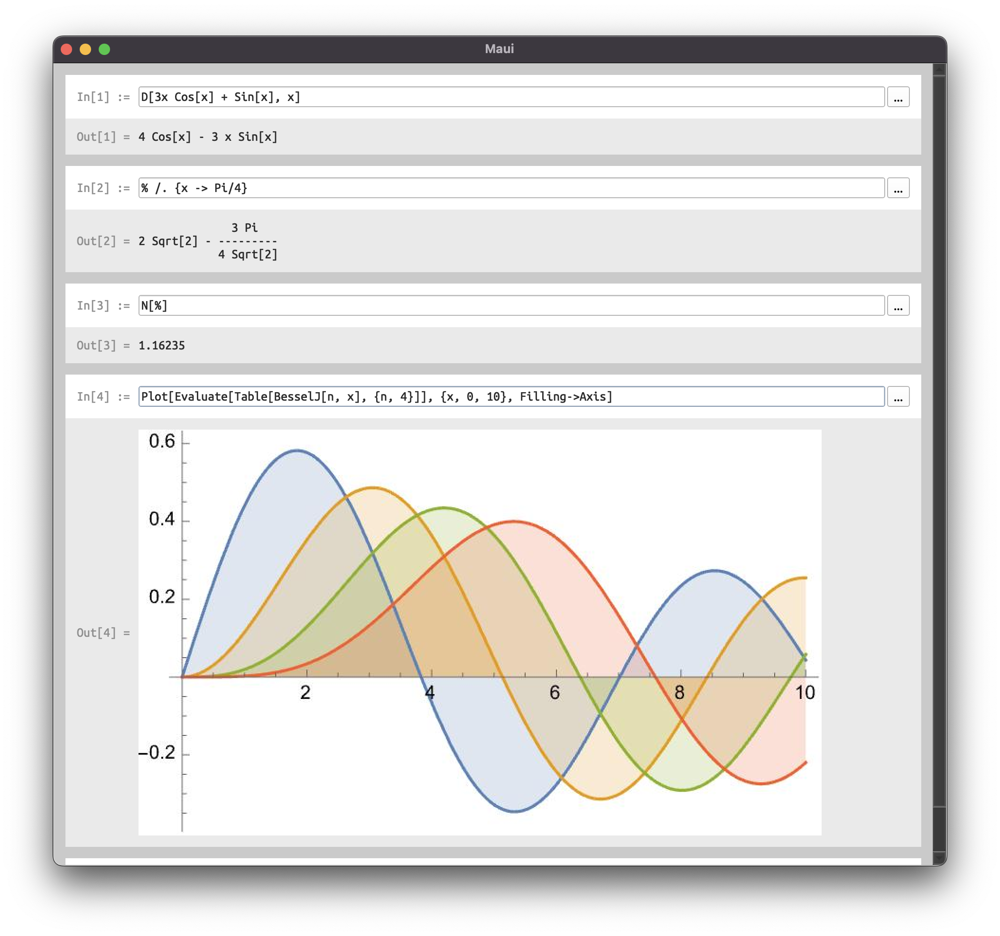

# Maui

Maui is an open source desktop application providing a user interface for the
free [Wolfram Engine](https://www.wolfram.com/engine/).

<div align="center">
  
  <br/>
</div>

## Dependencies

Maui has two main dependencies:

 - [Qt](https://www.qt.io/product/qt6)
 - WSTP (formerly MathLink) C API (part of [Wolfram Engine](https://www.wolfram.com/engine/))

The WSTP C API is included with the Wolfram Engine which is free for personal
use. Before attempting to build Maui, download and install the Wolfram Engine.
For assistance, see [the official setup guide](https://support.wolfram.com/45743).

## Build instructions

Once all dependencies are installed, simply use CMake to generate the
appropriate build environment, then build Maui:

```sh
cmake -S . -B build -DWSTP_API_PATH="..." # -GNinja
cmake --build build
```

If the WSTP C API headers and libraries are already in your system paths
(which is unlikely), then passing the `-DWSTP_API_PATH` option to CMake is not
needed.

## Setup and usage

If you have not yet launched the Wolfram Engine CLI, go ahead and do so, making
sure to complete the activation process. Maui will not work if the Wolfram
Engine is not activated.

Upon launching Maui for the first time, a configuration dialog will appear. You
will need to specify the path of the Wolfram Kernel to use as the backend.

<div align="center">
  
  <br/>
</div>

If you would like Maui to remember your choice, check the "Use as default
kernel" checkbox.

Upon pressing the "Launch" button, the main Maui window will appear and you can
begin working.

## Contribution guidelines

Contributions are welcome! All code is formatted with `clang-format` using the
built-in "WebKit" preset; please ensure your code is formatted when submitting
a pull request.

## License

Copyright &copy; 2021 Jon Palmisciano; licensed under the BSD 3-Clause license.
